# Rapport de projet : Assistant IA 🚲 Paris by Bike
## Un agent conversationnel multi-compétences (RAG +outils)

**Auteur :** Adam Faik

**Date :** Novembre 2025

**Repo GitHub :** [github.com/adamfaik/paris-by-bike-agent](https://github.com/adamfaik/paris-by-bike-agent)

---

### 1. Synthèse et opportunité business

Ce projet répond à un défi pour de nombreuses entreprises : comment transformer une vaste base de connaissances statiques (guides, rapports, manuels) en une expérience utilisateur interactive, personnalisée et actionnable ?

La solution est "Paris by Bike", un prototype d'assistant expert conçu pour le cyclisme à Paris. Il ne se contente pas de répondre à des questions, il agit comme un véritable concierge intelligent.

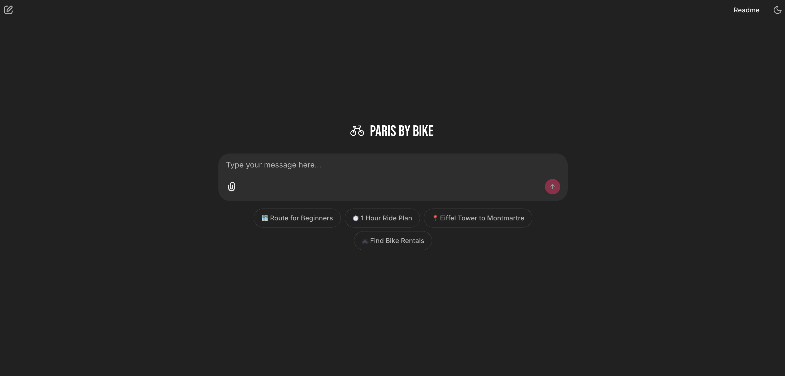

La valeur business de cette approche est double :
1.  **Valorisation des actifs de connaissances :** L'assistant utilise le RAG (Retrieval-Augmented Generation) pour transformer des documents internes (guides, règles) en réponses instantanées et contextuelles.
2.  **Engagement et conversion :** En intégrant des outils (Météo, Cartes, Recherche Web), l'assistant ne se contente pas d'informer, il *assiste* l'utilisateur dans son parcours, depuis l'inspiration jusqu'à l'action (ex: "Voici le lien Google Maps pour votre trajet"), augmentant ainsi la rétention et la satisfaction.

Ce prototype sert de fondation pour tout assistant expert, qu'il s'agisse de tourisme, de support technique, de conseil juridique ou de formation interne.

#### Stack technique

L'architecture est conçue pour être à la fois performante et flexible :
* **Orchestration :** LangChain & LangGraph (Agent `create_react_agent`).
* **LLM (chat) :** Stratégie hybride (définie dans `agent_logic.py`) :
    * **Cloud :** `ChatGroq` (modèle `llama-3.3-70b-versatile`) si une `GROQ_API_KEY` est détectée (pour la vitesse).
    * **Local :** `ChatOllama` (modèle `llama3.1`) en fallback (pour la confidentialité et l'accès hors-ligne).
* **LLM (embeddings) :** `OllamaEmbeddings` (modèle `nomic-embed-text`) pour la vectorisation.
* **Base vectorielle (RAG) :** **FAISS** (stockage local, `faiss_store/`).
* **Interface (UI) :** **Chainlit** pour son intégration native avec LangChain.
* **Outils externes :** API OpenWeatherMap (météo) et API Tavily Search (recherche web).

---

### 2. Scénario de démo : Le flux utilisateur complet

Pour illustrer le fonctionnement intégré de l'assistant, voici un scénario utilisateur complet. Il met en évidence la capacité de l'agent à router la requête vers la bonne compétence (chat simple, RAG, ou outil) en fonction du contexte.

1.  **Utilisateur (chat simple) :** `Hello`
    * **Logique de l'agent :** L'agent identifie une salutation. Le `SYSTEM_PROMPT` l'instruit de répondre naturellement sans outil.
    * **Réponse :**

    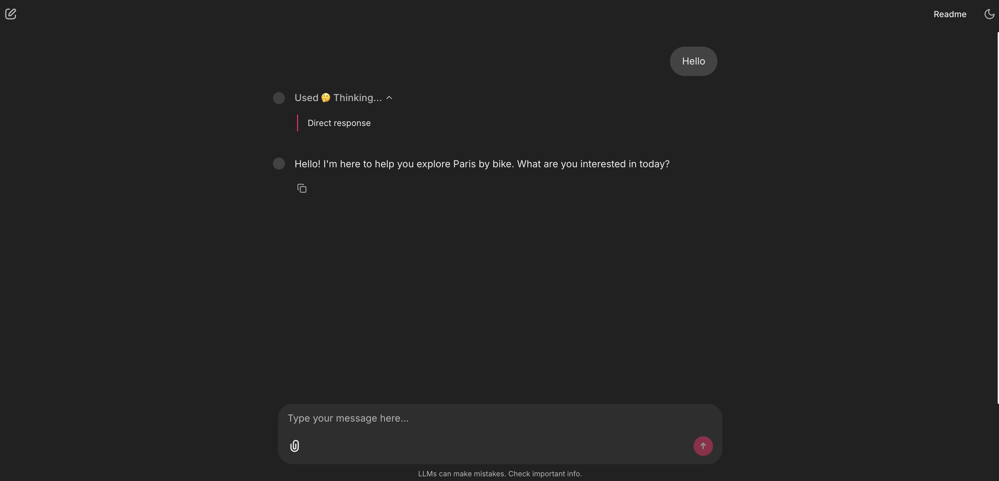

2.  **Utilisateur (RAG) :** `What's a good scenic route for beginners in Paris?`
    * **Logique de l'agent :** L'agent identifie une question de connaissance.
    * **Action (visible dans Chainlit) :** Appel de l'outil `paris_bike_guide(query="scenic route for beginners in Paris")`.
    * **Réponse :**
    
    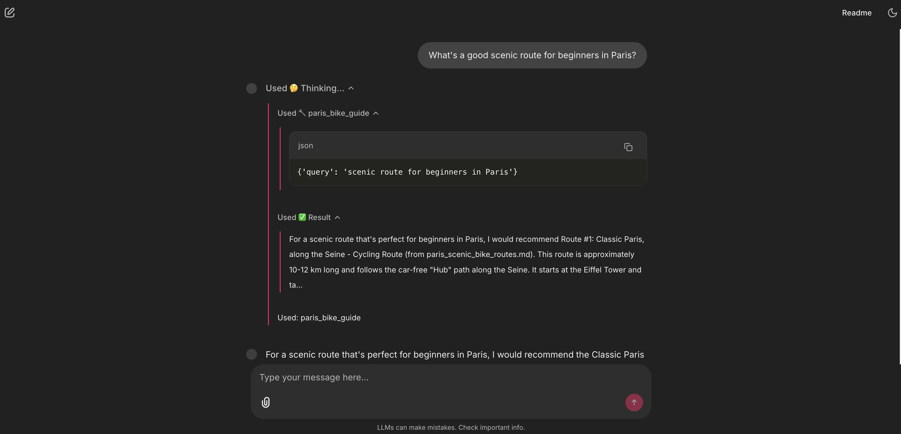
    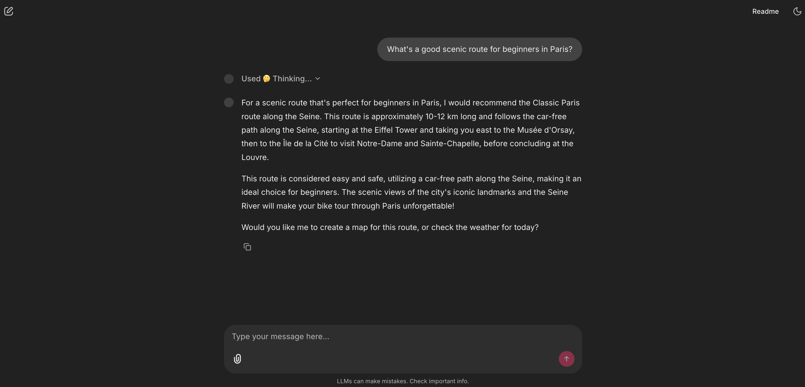

3.  **Utilisateur (outil météo) :** `Is it too windy to bike today?`
    * **Logique de l'agent :** L'agent identifie une demande de données en temps réel.
    * **Action :** Appel de l'outil `get_weather(location='Paris')`.
    * **Réponse :**

    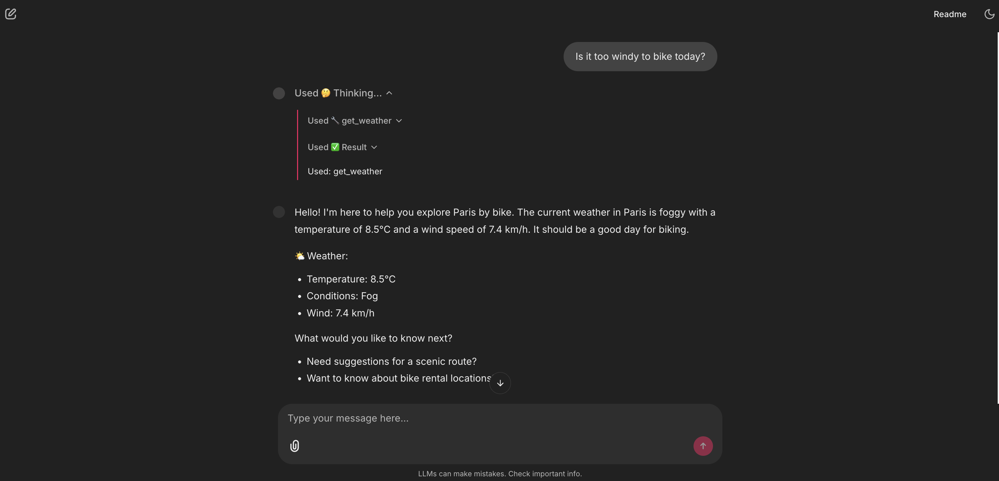

4.  **Utilisateur (outil calcul) :** `I have 90 minutes to bike, how far can I go?`
    * **Logique de l'agent :** L'agent identifie un besoin de calcul.
    * **Action :** Appel de l'outil `calculate_biking_plan(duration_minutes=90)`.
    * **Réponse :**

    

5.  **Utilisateur (outil web) :** `Are there any cycling events happening in Paris this weekend?`
    * **Logique de l'agent :** L'agent comprend "Paris" et "événements... aujourd'hui" (recherche web).
    * **Action :** Appel de l'outil `web_search(query="cycling events in Paris this weekend")`.
    * **Réponse :**

    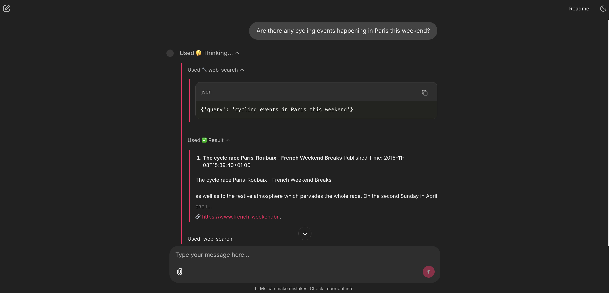
    

6.  **Utilisateur (outil map) :** `Show me the bike route from Eiffel Tower to Montmartre`
    * **Logique de l'agent :** L'agent identifie une demande de navigation.
    * **Action :** Appel de l'outil `generate_route_map(start_location='Eiffel Tower', end_location='Montmartre', waypoints='None')`.
    * **Réponse :**

    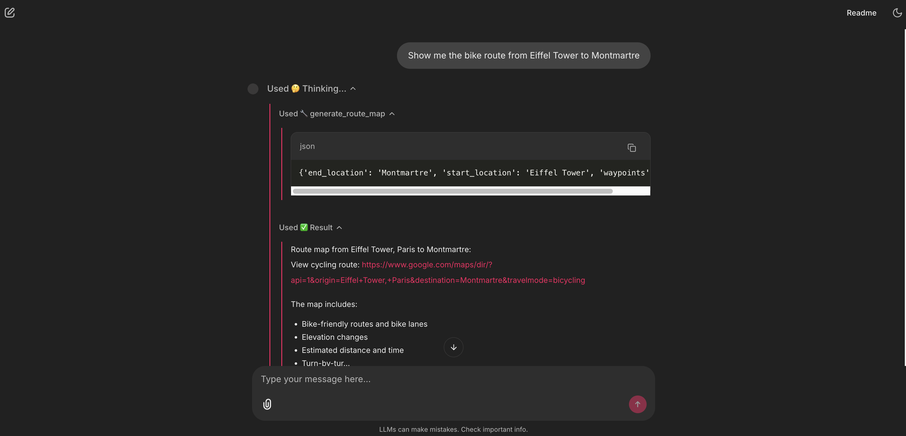
    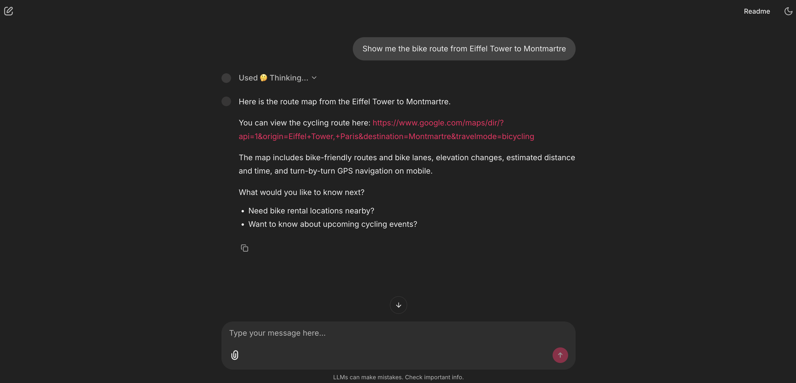
    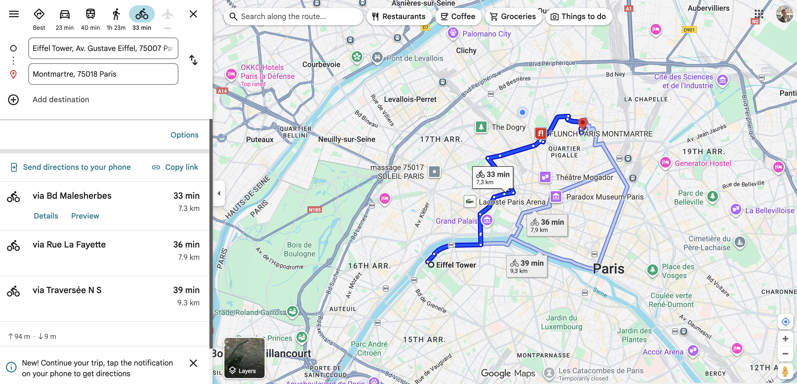

7.  **Utilisateur (appel multi-outils : RAG + météo) :** `Planning to bike to Versailles tomorrow, is it a good idea?`
    * **Logique de l'agent :** L'agent décompose la question :
        1.  "aller à Versailles à vélo" -> Nécessite des connaissances (RAG).
        2.  "demain" -> Nécessite la météo (outil météo).
    * **Action 1 :** Appel de `paris_bike_guide(query="biking to Versailles")`.
    * **Action 2 :** Appel de `get_weather(location='Versailles')`. (L'agent est assez intelligent pour savoir que la météo de "Paris" n'est pas suffisante et utilise "Versailles" comme localisation).
    * **Réponse :**

    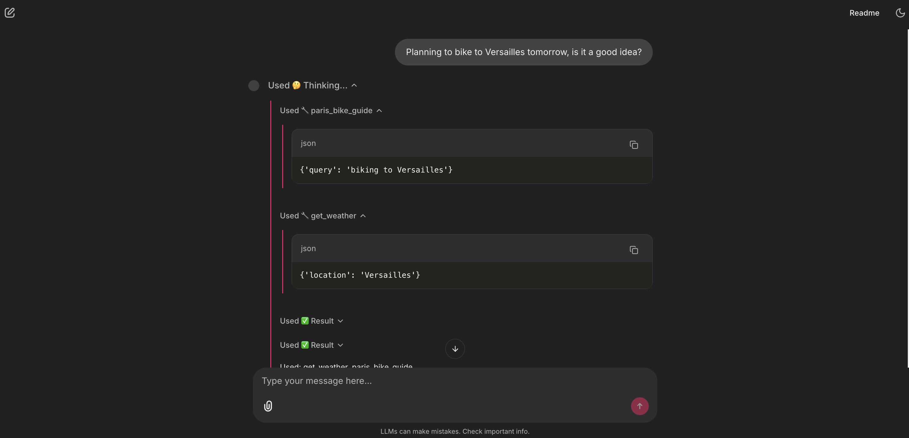
    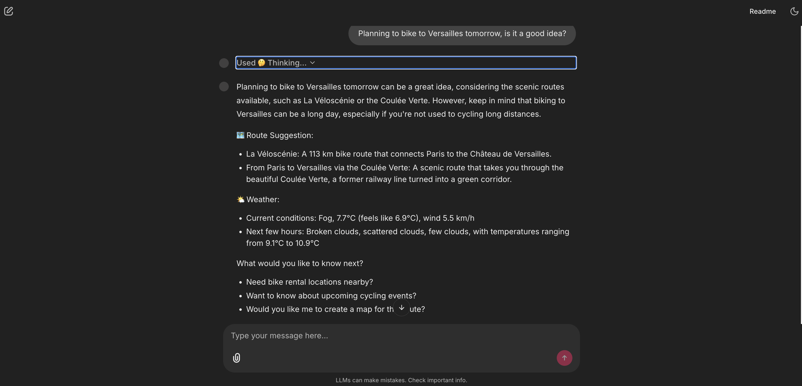

---

### 3. Architecture de la solution

L'assistant est construit sur trois piliers techniques : une base de connaissance (RAG), des capacités d'action (outils), et un cerveau (agent) pour orchestrer le tout.

#### 3.1 Le RAG

* **Corpus documentaire sur mesure :**
    La constitution d'un corpus pertinent était un défi. Les PDF publics sont souvent mal formatés ou trop génériques.
    * **Solution :** Pour garantir une expertise réelle, j'ai utilisé l'outil **Deep Research de Gemini** pour générer **10 rapports experts au format Markdown (`.md`)**. Chaque fichier est dédié à un sujet précis (location, itinéraires sportifs, sécurité, cafés vélo, etc.), créant ainsi une base de connaissances propriétaire, dense et de haute qualité.
    * *Fichiers clés :* `paris_bike_rental_guide.md`, `paris_biking_rules_and_safety.md`, `paris_scenic_bike_routes.md`, etc. (Total de 10 fichiers dans `/data/`).

* **Ingestion et indexation (script : `rag_pipeline.py`) :**
    * **Loaders :** Le script charge dynamiquement tous les fichiers `.md` et `.pdf` trouvés dans le dossier `/data/`.
    * **Chunking :** `RecursiveCharacterTextSplitter` est utilisé pour diviser les documents en segments sémantiques (chunk_size=1000, overlap=200).
    * **Embeddings :** Les segments sont vectorisés via `OllamaEmbeddings(model="nomic-embed-text")`.
    * **Stockage (FAISS) :** Le choix s'est porté sur **FAISS** pour sa rapidité et son stockage local (`faiss_store/`), évitant la complexité d'une base de données externe. L'index est chargé en mémoire au démarrage.

* **Récupération et génération (Script : `rag_pipeline.py`) :**
    * Le pipeline RAG est construit avec LangChain Expression Language (LCEL). Le `retriever` FAISS récupère les 4 "chunks" les plus pertinents.
    * Ces chunks sont passés comme `{context}` au `RAG_PROMPT_TEMPLATE`.
    * Le LLM (Groq ou Ollama) génère la réponse finale, avec instruction de citer ses sources (`📚 Sources used: ...`).

#### 3.2 L'agent et les outils

L'agent dispose de **5 outils** (définis dans `agent_logic.py`) pour étendre ses capacités au-delà du RAG.

* **Outil 1 : `paris_bike_guide` (outil RAG)**
    * **Rôle :** C'est le "cerveau" de l'agent. Il connecte l'agent au pipeline RAG (Partie 1). Il est prioritaire pour toute question de connaissance sur le vélo à Paris.
    * **Exemple :** "What are the biking rules in Paris? Can I bike on sidewalks?"

* **Outil 2 : `get_weather` (outil API météo)**
    * **Rôle :** Fournit des données en temps réel en appelant l'API OpenWeatherMap. Un fallback "demo data" est prévu si la clé API est absente.
    * **Exemple :** "Is it going to rain this afternoon? Should I bike now or later?"

* **Outil 3 : `web_search_tool` (outil de recherche web)**
    * **Rôle :** Complète la base RAG statique avec des informations actuelles (via Tavily).
    * **Exemple :** "Are there any cycling festivals in Paris in November 2025?"

* **Outil 4 : `calculate_biking_plan` (outil de calcul)**
    * **Rôle :** Fournit une capacité de calcul simple pour la planification (basée sur une vitesse moyenne de 15km/h).
    * **Exemple :** "Planning a 2-hour ride, what distance is that?"

* **Outil 5 : `generate_route_map` (outil de navigation)**
    * **Rôle :** Crée un livrable actionnable pour l'utilisateur en générant une URL Google Maps pré-remplie avec le mode "vélo".
    * **Exemple :** "Map out a route from Arc de Triomphe to Latin Quarter."

#### 3.3 Le routage et la mémoire

* **Routage intelligent (`SYSTEM_PROMPT`) :**
    Le cœur de la logique d'intégration réside dans le `SYSTEM_PROMPT` (fichier `agent_logic.py`). En utilisant `create_react_agent` (LangGraph), ce prompt agit comme un manifeste de routage. Des "CRITICAL RULES" claires forcent l'agent à décider s'il doit :
    1.  Répondre directement (pour une simple salutation).
    2.  Utiliser l'outil RAG `paris_bike_guide` (pour toute question de connaissance).
    3.  Utiliser un outil externe (pour la météo, le web, etc.).

* **Mémoire conversationnelle (`app.py`) :**
    * **Méthode :** La mémoire est gérée via une `chat_history` (liste de `HumanMessage` et `AIMessage`) stockée dans la session utilisateur (`cl.user_session`).
    * **Optimisation :** Pour maintenir le contexte immédiat, seule une "fenêtre glissante" des 6 derniers messages (`chat_history[-6:]`) est passée à l'agent. Cela lui permet de comprendre les questions de suivi (ex: "près de *cette* route") tout en optimisant la performance.

* **Interface (Chainlit) :**
    * Chainlit (`app.py`) est choisi pour son intégration native avec LangChain.
    * L'interface est personnalisée (`chainlit.md`, `.chainlit/config.toml`) et guide l'utilisateur avec des "Starters" (`@cl.set_starters`).
    * L'utilisation de `async with cl.Step(...)` est essentielle pour la transparence, montrant à l'utilisateur (et à l'évaluateur) quel outil est appelé et avec quels arguments.

---

### 4. Processus de conception et itérations

Ce projet a nécessité une approche itérative, notamment sur l'ingénierie du prompt système.

* **Tests de "personnalité" :** Plusieurs cycles de tests ont été effectués pour affiner le `SYSTEM_PROMPT`. Les premières versions étaient soit trop robotiques, soit trop "enthousiastes". Le prompt actuel est un équilibre trouvé pour un "compagnon amical" mais "direct et précis", avec des règles claires sur l'usage des emojis pour garder une apparence professionnelle.

* **Tests de routage :** Le `SYSTEM_PROMPT` a également nécessité des ajustements pour que l'agent comprenne la nuance critique entre `paris_bike_guide` (connaissances statiques, prioritaires) et `web_search` (informations volatiles, en second recours).

---

### 5. Analyse et prochaines étapes

Bien que le projet soit fonctionnel et réponde aux objectifs, une analyse critique révèle plusieurs axes d'amélioration clairs pour transformer ce prototype en un produit robuste.

#### 5.1. Points forts

* **Architecture hybride (cloud/local) :** La capacité de basculer entre Groq (vitesse) et Ollama (confidentialité) rend le projet très adaptable.
* **Base de connaissances RAG sur mesure :** Le corpus de 10 rapports `.md` générés par IA est le plus grand atout du projet, offrant une expertise que le web seul ne peut fournir.
* **Agent multi-outils robuste :** L'agent combine 5 outils de manière cohérente pour résoudre un problème utilisateur complexe.

#### 5.2. Pistes d'amélioration

1.  **Persistance et cache de l'index FAISS :**
    * **Problème :** Recharger l'index FAISS à chaque démarrage est inefficace.
    * **Solution :** Implémenter une vérification de "fraîcheur" (comparer la date de modification du dossier `/data/` avec un timestamp). L'index ne serait reconstruit que si les documents ont changé, rendant les démarrages quasi instantanés.

2.  **Ajout de guardrails pour l'outil de carte :**
    * **Problème :** L'outil `generate_route_map` peut échouer si l'utilisateur donne une entrée partielle (ex: "de la Tour Eiffel à ?").
    * **Solution :** Renforcer la fonction en validant que `start_location` et `end_location` ne sont pas vides, et en utilisant `urllib.parse.quote_plus()` pour encoder systématiquement les entrées et garantir des URL valides.

3.  **Mémorisation des préférences utilisateur :**
    * **Problème :** L'agent est "généraliste". Si l'utilisateur dit "J'ai mon propre vélo", l'agent continue de lui suggérer des magasins de location.
    * **Solution :** Utiliser `cl.user_session` pour stocker des préférences (ex: `user_session.set("owns_bike", True)`, `user_session.set("prefs", "food")`). Le `SYSTEM_PROMPT` serait alors enrichi à chaque tour avec ces préférences ("CONTEXTE UTILISATEUR : Le client possède un vélo. NE PAS suggérer de location.").

4.  **Intégration des résultats dans l'UI :**
    * **Problème :** Un utilisateur qui clique sur un lien Google Maps ou Tavily *quitte* l'application, ce qui nuit à la rétention.
    * **Solution :** Utiliser les éléments natifs de Chainlit. Au lieu d'un lien, afficher une carte interactive (via un iframe Google Maps) avec `cl.Embed` directement dans le chat. De même, formater les résultats de recherche web avec `cl.Text` au lieu de simples liens.

---

### 6. Conclusion

Ce projet démontre avec succès la puissance d'une architecture hybride (RAG + agents). En partant d'une base de connaissances experte générée sur mesure et en l'intégrant dans un agent LangGraph multi-outils (Météo, Web, Calcul, Map), "Paris by Bike" n'est pas un simple chatbot, mais un véritable prototype d'assistant à valeur ajoutée.

Les défis rencontrés, notamment dans la création des données et l'ingénierie des prompts, ont été des apprentissages clés. Les pistes d'amélioration identifiées (cache, personnalisation, UI embarquée) tracent une feuille de route claire vers une application "produit" robuste et commercialement viable.

---

### 7. Annexes et repo

* **Repo GitHub :** [github.com/adamfaik/paris-by-bike-agent](https://github.com/adamfaik/paris-by-bike-agent)
* **Fichiers de Référence :**
    * `agent_logic.py` : Définition de l'agent, des outils et du system prompt.
    * `rag_pipeline.py` : Logique d'indexation FAISS et de la chaîne RAG.
    * `app.py` : Logique de l'interface Chainlit, gestion de la mémoire et des étapes.
    * `data/` : Corpus de 10 documents Markdown.
    * `README.md` : Instructions complètes de déploiement et d'utilisation.